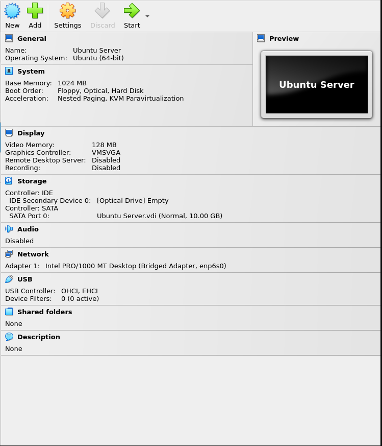
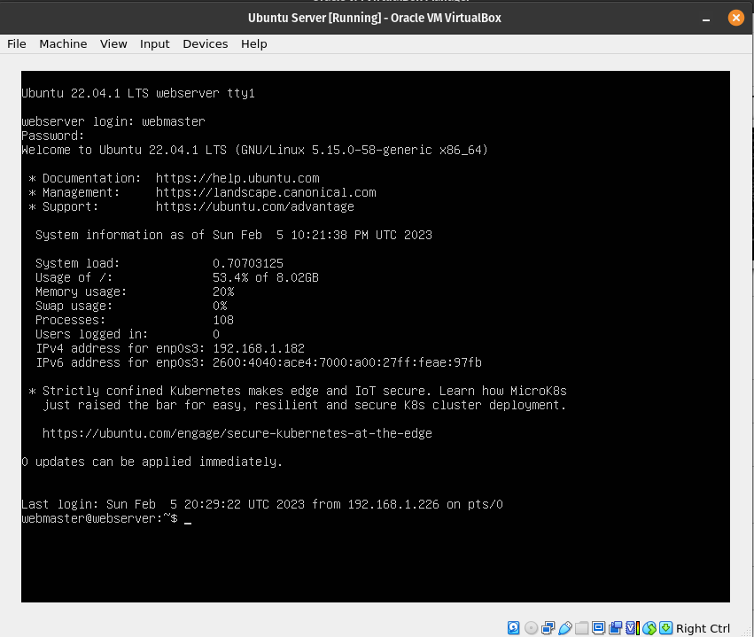

# Deliverable 2 Submission

## Server Specifications

## Ubuntu Login Screen

## Questions
3. **What is the IP address of your Ubuntu Server Virtual Machine?**
   
4. **How do you enable the Ubuntu Firewall?**
   
5. **How do you check if the Ubuntu Firewall is running?**
   
6. **How do you disable the Ubuntu Firewall?**
   
7. **How do you add Apache to the Firewall?** 
   
8. **What is the command you used to install Apache?**
   
9.  **What is the command you use to check if Apache is running?**
    
10. **What is the command you use to stop Apache?**
    
11. **What is the command you use to restart Apache?**
    
12. **What is the command used to test Apache configuration?**
    
13. **What is the command used to check the installed version of Apache?**
    
14. **What are the most common commands to troubleshoot Apache errors? Provide a brief description of each command.**
    
15. **Which are Apache Log Files, and what are they used for? Provide examples and screenshots.**
    