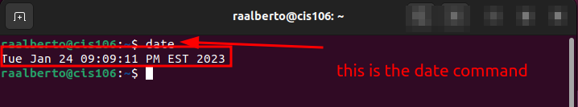
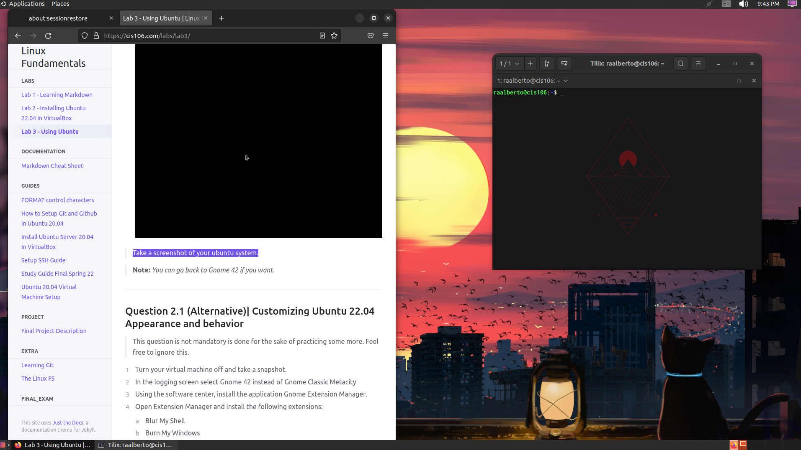

# Lab 3 Submission

## Question 1

## Question 2

## Question 3

| Program purpose     | Package Name      | Version            |
| ------------------- | ----------------- | ------------------ |
| Play a tetris game  | blockattack       | 2.7.0-1            |
| Play a video file   | dragonplayer      | 4:21.12.3-0ubuntu1 |
| Browse the internet | epiphany-browser  | 42.4-0ubuntu1      |
| Read your email     | place holder text | place holder text  |
| Play music          | place holder text | place holder text  |

## Question 4

| command | what it does                          |
| ------- | ------------------------------------- |
| echo    | you need to complete this on your own |
| fortune | you need to complete this on your own |
| cowsay  | you need to complete this on your own |
| lolcat  | you need to complete this on your own |
| figlet  | you need to complete this on your own |
| toilet  | you need to complete this on your own |
| rig     | you need to complete this on your own |
