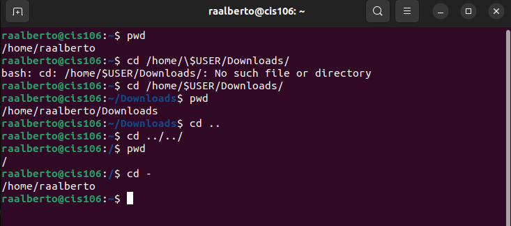
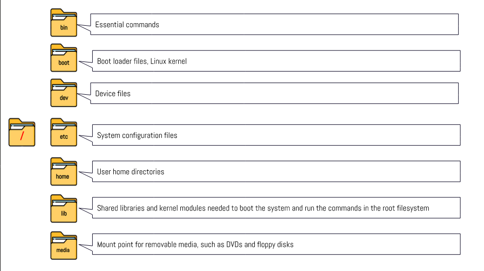
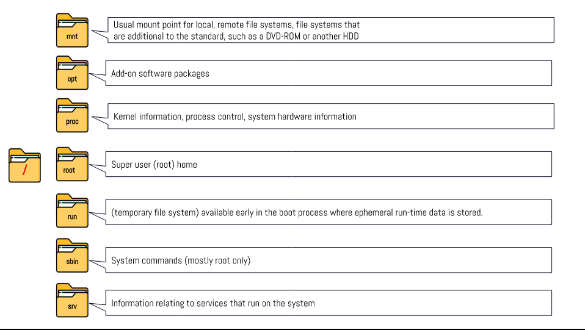

# Week Report 4

## Practice from the presentation The Linux File system: 
### Practice 1
 
### Practice 2

### Practice 3

## The Linux File system directories and their purpose: 

 
 

## All the commands for navigating the filesystem   

| Command | What it does             | Syntax      | Example        |
| ------- | ------------------------ | ----------- | -------------- |
| pwd     | prints current directory | pwd         | `pwd`          |
| cd      | description here         | syntax here | `example here` |
| ls      | description here         | syntax here | `example here` |

## Basic terminology 
* **File system:** type definition here
* **Current directory:** type definition here
* **parent directory:** type definition here
* **the difference between your home directory and the home directory:**type definition here
* **pathname:** type definition here
* **relative path:** type definition here
* **absolute path:** type definition here
