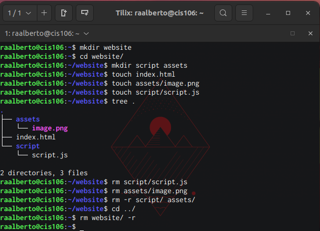

# Week Report 5

## Answer to questions:

* **What are Command Options?**
answer goes here 
* **What are Command Arguments?**

* **Which command is used for creating directories? Provide at least 3 examples.**
the command is mkdir.
* example 1:
  * Create a directory: `mkdir potatoes`
* example: 2:
  * create multiple directories: `mkdir movies ~/Downloads/games ~/Documents/hmw `
* **What does the touch command do? Provide at least 3 examples.**
* **How do you remove a file? Provide an example.**
* **How do you remove a directory and can you remove non-empty directories in Linux? Provide an example**
* **Explain the mv and cp command. Provide at least 2 examples of each**

## Practice 1
 
## Practice 2
## Practice 3
## Practice 4
